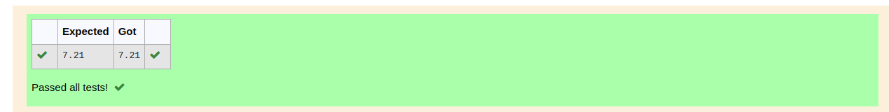

# DISTANCE-BETWEEN-TWO-POINTS

## AIM:
To write a python program to find the distance two 2 points
## ALGORITHM:
### Step 1: 
Write a program to find distance
### Step 2: 
Get the input
### Step 3: 
Substitute the values in the distance formula  
### Step 4: 
Execute the program
### Step 5: 
Get the result
### PROGRAM:
  ```python

#Program to find the distance between two points.
#Developed by: Vishnupriya R
#RegisterNumber:22006962
import math
l1=[10,6]
l2=[4,2]
d=math.sqrt(math.pow(l2[0]-l1[0],2)+math.pow(l2[1]-l1[1],2))
print("{:.2f}".format(d))
```

### OUTPUT:


### RESULT:
A python pragram is written to find the distance between 2 points.
